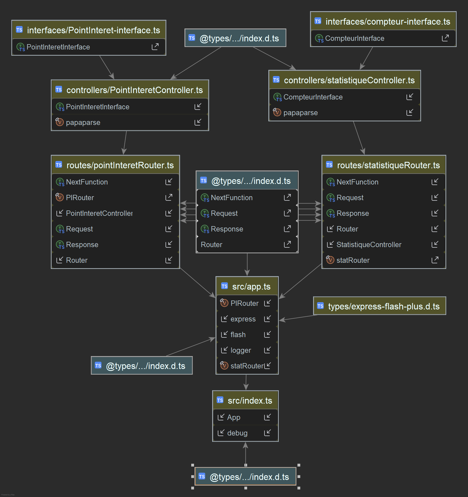

# Livrable 1

---

Groupe: 01
 
Équipe: 11

**Membres de l'équipe:**

- Franck Patrick Assan
- Monclés Junior Hérissé
- Anthony Tremblay

---

## Évaluation de la participation

| Nom de l'étudiant      | Facteur multiplicatif |
| ---------------------- | --------------------- |
| Franck Patrick Assan   | 1                     |
| Monclés Junior Hérissé | 1                     |
| Anthony Tremblay       | 1                     |

---

# Introduction

L'application PédaMap est une une application web dévélopper dans le cadre du
cours GTI525 à l'hivers 2025. C'est une application qui va permettre aux
adeptes de vélos de facilement consulter les les itinéraire, et informations
sur le réseau cyclable de la belle ville de Montréal.
Le projet est divisé en plusieurs livrables.  Pour ce premier livrable,
nous utiliserons différentes technologies web, dans le but de construire la
partie statique (présentation) de l'application. Tout d'abord, nous verrons
l'architecture que notre équipe à decider d'utiliser, pour développer cette
solution. Ensuite, nous exposerons les technniques et outils utilisés pour
traiter les données fournis pour ce livrable et finalement, on verra comment
les tâches liées au projet ont été assignées aux différents membres de l'équipe.

---

# Architecture logicielle utilisée

Étant donnée que nous devions concevoir une application Web, nous avons
choisit le patron architectural Client-Serveur. Nous avons décider d'utiliser
ExpressJs, un framework minimaliste mais facilement extensible en fonction
de nos objectifs. Pour la délivrance du contenue statique de la page,
ExpressJs nous permet de générer le contenu HTML et CSS du côté serveur.

Nous allons voir quelque diagrammes de l'architechture utilisée :

### Diagrame de contexte :

### Diagrame de conteneurs :

### Diagramme de classes

---

# Triage des tableaux

Pour le triage des tableaux nous avons utilisé une librairie qui s'occupe de trier le tableau pour nous.
La librairie s'appelle dataTable. Tu peux cliquer sur une colonne et sa va trier la table pour cette colonne.
Tu peux aussi faire une recherche pour trouver une valeur et tu peux faire une pagination pour le tableau

---

# Subdivision des tâches

pour la subdivision des tâches, on a divisé page. Chacun de nous avais deux ou trois pages à faire.
La page principal et la page d'interêt a été fait par notre Moncles Junior Herissé. Ensuite la page des statistiques
et la page d'itinéraires a été fait par Franck Patrick Assan. Finalement la page de description de l'équipe et la page du
description du projet a été fait par Anthony Tremblay.

---

# Conclusion
